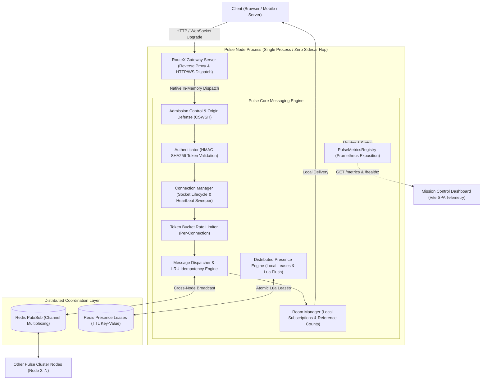
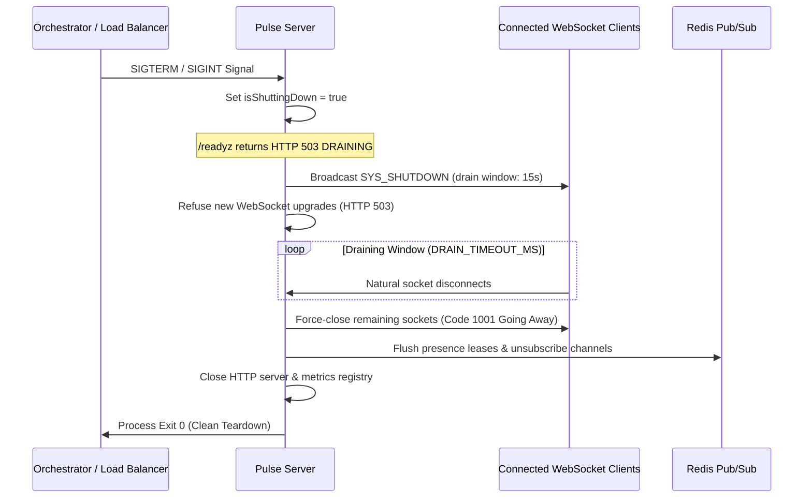

# Pulse

## Distributed Real-Time Messaging Infrastructure

[](https://www.npmjs.com/package/@ankit18193/pulse)
[](LICENSE)
[](package.json)
[](tsconfig.json)
[](https://datatracker.ietf.org/doc/html/rfc6455)
[](https://redis.io)

> **Pulse is a production-oriented distributed real-time messaging infrastructure for Node.js and TypeScript.**

Pulse delivers a scalable, resilient real-time messaging engine engineered for distributed workloads. Built on native RFC 6455 WebSockets (`ws`), Redis cluster Pub/Sub, Lua-driven distributed presence leases, cryptographic token authentication, and multi-tier traffic defense, Pulse solves the distributed systems challenges of connection admission, socket lifecycles, cross-node fan-out, delivery acknowledgments, backpressure mitigation, and zero-downtime graceful draining.

---

## 1. Why Pulse?

Real-time messaging is frequently misunderstood as simply opening a WebSocket and broadcasting JSON. In production environments, socket transport is only the outermost transport boundary. Real systems encounter severe failure modes:

- **Connection Lifecycle & Storms**: Handling thousands of concurrent handshakes without event-loop starvation, socket leaks, or half-open socket buildup.
- **Authentication & Authorization**: Enforcing strict cryptographic verification during the HTTP upgrade before connection slots are committed.
- **Message Ordering & Deduplication**: Providing monotonic chronological sorting and idempotent delivery in the presence of retries and network jitter.
- **Delivery Acknowledgments (ACKs)**: Providing explicit confirmation of delivery and recipient fan-out counts back to senders.
- **Distributed State & Presence**: Maintaining real-time multi-device user presence across cluster nodes without ghost sessions when instances crash.
- **Redis Coordination Overhead**: Avoiding redundant cross-node hops when sockets are colocated on the same local process.
- **Backpressure & Saturation**: Evicting slow consumers before kernel TCP buffers saturate and exhaust process heap memory.
- **Traffic Protection**: Defending against Cross-Site WebSocket Hijacking (CSWSH), subscription exhaustion, and frame floods via token-bucket metering.
- **Zero-Downtime Draining**: Transitioning readiness probes to HTTP 503 and gracefully draining active connections over a controlled timeout window during rolling deployments.
- **Observability**: Exposing native Prometheus metrics and continuous Node.js event-loop lag diagnostics.

> **Important**: The included chat UI and Traffic Sandbox are operational testing and demonstration interfaces. The infrastructure underneath them is the actual project.

---

## 2. Core Capabilities

Pulse provides an enterprise-ready messaging core designed for horizontal scaling:

### Real-Time Communication
- **Native RFC 6455 WebSockets**: Built directly on `ws` without heavyweight protocol wrappers.
- **Dynamic Room Subscriptions**: Topic- and channel-based pub/sub with atomic room join/leave and reference-counted subscriptions.
- **Direct Messaging (`DIRECT_MESSAGE`)**: Peer-to-peer routed messaging targeting specific authenticated user IDs.
- **Delivery Acknowledgments (`DELIVERY_ACK`)**: End-to-end receipt confirmation with correlation IDs, timestamps, and delivered recipient counts.
- **Deterministic Chronological Ordering**: RFC 9562 UUIDv7 identifiers provide time-ordered sorting at microsecond granularity.
- **In-Memory Idempotency Cache**: High-performance LRU ring buffer (10,000 capacity, 60s TTL) eliminating duplicate frames and handling replayed ACKs.

### Authentication & Admission Control
- **Cryptographic HMAC-SHA256**: Constant-time signature verification (`crypto.timingSafeEqual`) preventing timing attacks.
- **Flexible Token Extraction**: Supports URL query parameter (`?token=`), `Authorization: Bearer <token>`, and WebSocket subprotocol header (`Sec-WebSocket-Protocol: token.<token>`).
- **Token Expiration Enforcement**: Validates issued-at (`iat`) and expiration (`exp`) timestamps on every handshake.
- **Atomic Connection Admission**: Tracks pending and active sockets against `MAX_CONNECTIONS` capacity, rejecting over-capacity requests with `HTTP 503 Service Unavailable` before socket allocation.

### Reliability & Lifecycle Management
- **Heartbeat & Reaper Protocol**: Automated ping/pong sweeps (`SYS_PING` / `SYS_PONG`) every 30 seconds, terminating dead or half-open connections exceeding 10 seconds timeout.
- **Controlled Client Reconnect**: Bounded exponential backoff with randomized jitter to eliminate thundering-herd reconnect storms.
- **Two-Phase Graceful Shutdown**: Traps `SIGINT`/`SIGTERM`, marks `/readyz` as 503, signals connected sockets via `SYS_SHUTDOWN`, drains active streams over `DRAIN_TIMEOUT_MS`, and cleanly severs Redis resources.

### Distributed Systems & Clustering
- **Horizontal Scaling via Redis Pub/Sub**: Seamless cross-node messaging across unlimited Pulse instances.
- **Reference-Counted Channel Multiplexing**: Nodes subscribe to Redis channels only when local sockets are active in the room, eliminating idle cross-node traffic.
- **Loopback Suppression**: Outbound frames carry node `originInstanceId`, automatically dropping self-echoes.
- **Distributed Presence Leases**: Multi-device presence tracked via atomic Redis Lua scripts (`PRESENCE_HEARTBEAT`) with background renewal flushes, auto-expiring ghost sessions on crash.
- **Degraded Local Fallback**: Automatically degrades to single-node operation if Redis disconnects, and resynchronizes active presence leases upon reconnection.

### Traffic Protection & Hardening
- **CSWSH Defense**: Strict origin matching against configurable `ALLOWED_ORIGINS`. Disallows wildcards in production.
- **Token-Bucket Rate Limiting**: Per-socket inbound metering (`INBOUND_RATE_LIMIT_MAX` refill, `INBOUND_RATE_LIMIT_BURST` capacity). Abusive sockets are closed with RFC 6455 policy violation (`1008`).
- **Backpressure & Slow Consumer Protection**: Monitors socket `bufferedAmount`, evicting saturated connections that exceed `MAX_BUFFERED_AMOUNT_BYTES` (default 1 MiB).
- **Resource Ceilings**: Enforces inbound frame size limits (`MAX_PAYLOAD_BYTES`), maximum rooms per socket (`MAX_ROOMS_PER_CONNECTION`), and room name length (`MAX_ROOM_ID_LENGTH`).

### Observability & Telemetry
- **Health & Readiness Endpoints**: `GET /healthz` (system health status) and `GET /readyz` (traffic readiness probe).
- **Prometheus Exposition**: Production-ready metrics formatted for Prometheus scrapers on `GET /metrics`.
- **Event-Loop Lag Telemetry**: Real-time tracking of Node.js event-loop latency (mean, p50, p99, max) with degraded cluster state alerts (>20ms).
- **Subsystem Status Diagnostics**: Live statistics on connection count, room counts, idempotency cache utilization, Redis pub/sub health, and presence counters.

---

## 3. Architecture

Pulse is designed with an embedded gateway architecture that avoids unnecessary network hops between edge routing and the messaging core:



### Embedded RouteX Architecture
RouteX (`@ankit18193/routex-gateway`) can run embedded directly inside the Pulse server process. By sharing the Node.js event loop:
1. **Zero Network Latency**: Web requests and WebSocket upgrades are dispatched in-memory without loopback TCP or IPC socket overhead.
2. **Clear Separation of Concerns**:
   - **RouteX**: Handles HTTP reverse proxying, upstream path routing, CORS headers, and pre-upgrade dispatch.
   - **Pulse**: Manages WebSocket connection state, room rosters, broadcast delivery, ACKs, heartbeats, presence tracking, and graceful shutdown.
   - **Redis**: Coordinates distributed pub/sub channels and cross-node presence leases.
   - **Mission Control**: Provides operational telemetry, traffic inspection, and load generation.

---

## 4. Architecture Flow

### Local Message Flow (Single Node)
When both sender and receiver are connected to the same Pulse instance:
1. **Client A** sends a `ROOM_MESSAGE` frame with `"ackRequired": true`.
2. **Ingress Pipeline**: Pulse verifies token-bucket rate limits and checks the `eventId` in the LRU idempotency cache.
3. **Local Fan-out**: Room Manager identifies all local sockets in `#lobby` and delivers the frame directly via in-memory references.
4. **Delivery ACK**: Pulse immediately transmits a `DELIVERY_ACK` envelope back to Client A containing the delivery timestamp and recipient count.

```
Client A ────> [WebSocket] ────> [Pulse Engine] ────> [Room Manager] ────> Client B
   ▲                                  │
   └────────── [DELIVERY_ACK] ────────┘
```

### Distributed Message Flow (Multi-Node Cluster)
When clients are distributed across multiple instances:
1. **Client A** on **Node A** broadcasts to `#engineering`.
2. **Node A** delivers to all local connections subscribed to `#engineering`.
3. **Node A** publishes the envelope to Redis channel `pulse:room:engineering` tagged with `originInstanceId: "pulse-node-1"`.
4. **Node B** receives the Redis message. Detecting that `originInstanceId !== "pulse-node-2"`, it fans out the frame to its local sockets in `#engineering`.
5. **Node A** receives its own published message from Redis but drops it via loopback suppression, preventing double delivery.

```
Client A ──> [Node A] ──> Local Sockets (Node A)
               │
               ▼
        [Redis Pub/Sub] ──> [Node B] ──> Local Sockets (Node B)
               │
               └─ (Node A drops loopback echo)
```

> **Design Principle**: Redis is employed strictly for cross-node fan-out and coordination. Local sockets never suffer a network round-trip through Redis when colocated on the same node.

---

## 5. Mission Control

Pulse includes **Mission Control**, a real-time operations cockpit built with React, Vite, and Lucide icons. Mission Control provides comprehensive visibility into running infrastructure:

- **Cockpit Overview**: Total cluster connections, active rooms, aggregate throughput (msg/s), p99 event-loop lag, and memory allocations.
- **Throughput Waveform**: Live rolling canvas waveform charting inbound vs outbound wire frames in real time.
- **Event-Loop Gauge**: Visual dial displaying p50/p99 Node.js event-loop lag with degradation thresholds.
- **Topology Grid**: Real-time status indicators for Redis Pub/Sub, Distributed Presence, RouteX Gateway, and Connection Sweeper.
- **Rooms & Roster Inspector**: Live table of active channels, subscriber counts, and presence members.
- **RouteX Gateway Inspector**: Active proxied routes, upstream targets, and health status.

### Mission Control

[SCREENSHOT — Mission Control Overview]

> Add screenshot here:
> `docs/images/mission-control-overview.png`

Live Mission Control:
https://pulse-dashboard-qcyf.onrender.com

---

## 6. Traffic Sandbox

The **Traffic Sandbox** is a built-in diagnostic and testing interface within Mission Control for validating WebSocket protocol behavior and cluster throughput:

- **Target Connection Setup**: Connect to any Pulse instance with optional HMAC-SHA256 authentication tokens.
- **Dev Token Helper**: One-click **Fill Dev Token** button in development mode to immediately inject valid HMAC tokens.
- **Room Subscriptions**: Join and leave rooms dynamically, observing real-time roster changes.
- **Frame Dispatcher**: Dispatch structured JSON or plain-text messages with automatic normalization into canonical `ROOM_MESSAGE` envelopes.
- **1-Click Traffic Generator**: Emit a 500 msg/s burst test to verify cluster throughput, latency curves, and backpressure handling.
- **Dedicated Message Activity Stream**: Human-readable activity feed showing SENT and RECEIVED messages, room identifiers, sender IDs, and real-time `DELIVERED` status chips upon receiving server `DELIVERY_ACK` frames.
- **Raw Wire Frame Inspector**: Ring buffer inspecting raw inbound and outbound JSON frames with direction filters (`ALL`, `INBOUND`, `OUTBOUND`).
- **Heartbeat Auto-Response**: Automatically responds to incoming `SYS_PING` frames with `SYS_PONG` to verify connection reaping.

[SCREENSHOT — Traffic Sandbox]

> Add screenshot here:
> `docs/images/traffic-sandbox.png`

---

## 7. RouteX Integration

Pulse natively integrates with [@ankit18193/routex-gateway](https://www.npmjs.com/package/@ankit18193/routex-gateway), a high-performance Node.js API Gateway and reverse proxy.

### Embedded Deployment
When RouteX is configured as a dependency of PulseServer:
```typescript
import { PulseServer } from '@ankit18193/pulse';
import { RouteXGatewayServer } from '@ankit18193/routex-gateway';

const routex = new RouteXGatewayServer({
  routes: [
    { prefix: '/api/v1', upstream: 'http://internal-api-service:3000' },
    { prefix: '/auth', upstream: 'http://auth-service:4000' }
  ]
});

const server = new PulseServer(
  { port: 8080 },
  {},
  { routexGateway: routex }
);

await server.start();
```

- **Same-Process Routing**: HTTP requests matching RouteX prefixes are reverse-proxied to internal upstreams.
- **Pre-101 Upgrade Dispatch**: Non-Pulse WebSocket requests can be routed to upstream services through RouteX, while Pulse captures native messaging upgrades.
- **Zero Sidecar Latency**: Eliminates the operational complexity, CPU overhead, and container hop of external reverse proxies (e.g., Nginx, Envoy) for Node.js workloads.

GitHub: [https://github.com/ankit18193/RouteX](https://github.com/ankit18193/RouteX)

---

## 8. Redis and Distributed Presence

### Redis Pub/Sub Mesh
Pulse uses two dedicated Redis client connections per node (one publisher, one subscriber) managed through `ioredis`:
- **Dynamic Channel Management**: Sockets joining room `room-abc` register a reference count. When the count transitions $0 \rightarrow 1$, the node issues a Redis `SUBSCRIBE pulse:room:room-abc`. When the count drops to 0, it issues an `UNSUBSCRIBE`.
- **Loopback Suppression**: Every published envelope embeds the originating node's `instanceId`. Nodes ignore their own broadcasts.

### Distributed Presence Engine
Presence state is coordinated through Redis using atomic Lua scripts:
- **Presence Leases**: User online sessions are stored with an ephemeral TTL lease (`PRESENCE_TTL_MS`, default 60 seconds).
- **Background Renewal Pipeline**: An asynchronous timer flushes active local presence leases to Redis every `PRESENCE_FLUSH_INTERVAL_MS` (default 15 seconds) using pipelined commands.
- **Multi-Device Aggregation**: If a user connects from a laptop and mobile phone, presence records 2 active connections. An `ONLINE` transition is broadcast on the first connection; an `OFFLINE` transition is broadcast only when the final connection closes or its lease expires.
- **Degraded Mode Resilience**: If Redis becomes unavailable, Pulse switches seamlessly to a local-only presence mode without terminating active WebSocket connections. When Redis connectivity is restored, local leases are automatically re-synchronized.

> **Note on Testing**: Single-node tests do not validate cluster partitioning or split-brain presence recovery. Refer to the automated distributed test suite (`tests/redis/` and `tests/distributed/`) for multi-node validation evidence.

---

## 9. Security

Pulse is engineered with defense-in-depth security invariants:

| Security Domain | Implementation | Failure Mode Defense |
| :--- | :--- | :--- |
| **Origin Validation** | `OriginMatcher` enforces `ALLOWED_ORIGINS` | Handshake rejected with `HTTP 403 Forbidden` (CSWSH defense). |
| **Token Verification** | HMAC-SHA256 with `crypto.timingSafeEqual` | Handshake rejected with `HTTP 401 Unauthorized` on bad signature or structure. |
| **Token Expiration** | Enforces `exp` and `iat` timestamps | Handshake rejected with `HTTP 401 Unauthorized` on expired token. |
| **Secret Hardening** | In production, `AUTH_SECRET` must be $\ge 32$ chars | Server fails fast at bootstrap if secret is weak or default. |
| **Connection Admission** | Atomic slot reservation against `MAX_CONNECTIONS` | Over-capacity handshakes rejected with `HTTP 503 Service Unavailable`. |
| **Rate Limiting** | Token bucket per socket (`INBOUND_RATE_LIMIT_MAX`) | Frames dropped with `SYS_ERROR: RATE_LIMIT_EXCEEDED`; abusive sockets closed with `1008`. |
| **Backpressure Ceiling** | Tracks `socket.bufferedAmount` against 1 MiB limit | Saturated sockets closed to protect process heap from OOM. |
| **Payload Guardrails** | Frame size capped at `MAX_PAYLOAD_BYTES` (64 KiB) | Oversized frames dropped; socket closed with `1009 Frame Too Large`. |
| **Reverse Proxy Trust** | `TRUST_PROXY` enables trusted CIDR extraction | Accurate client IP logging and rate limiting behind Render/Cloudflare ALB. |

> **Security Warning**: Never configure `ALLOWED_ORIGINS=*` or use trivial secrets in production environments. Set cryptographically random secrets generated via `openssl rand -hex 32`.

---

## 10. Reliability and Graceful Shutdown

### Heartbeat Sweeper Protocol
Pulse proactively detects and cleans up abandoned or dead connections (e.g., client network switch, dead mobile device, hard reboot):
1. **Periodic Ping**: Every `HEARTBEAT_INTERVAL_MS` (default 30 seconds), the server sends a `SYS_PING` envelope with an `eventId`.
2. **Pong Expectation**: Clients must reply with `SYS_PONG` referencing the correlation ID.
3. **Dead Connection Reap**: Connections that fail to respond within `HEARTBEAT_TIMEOUT_MS` (default 10 seconds) are terminated with RFC 6455 code `1002` (Protocol Error), freeing local and Redis presence resources immediately.

### Graceful Draining Lifecycle
Pulse ensures zero dropped frames during deploys and horizontal auto-scaling:



[SCREENSHOT — Graceful Shutdown / Health]

> Add screenshot here:
> `docs/images/health-readiness.png`

---

## 11. Testing

Pulse maintains a comprehensive test suite of **93 test suites and 431 automated tests**, structured across five verification phases:

- **P0 — Protocol and Reliability Safety**: RFC 6455 compliance, envelope serialization, room join/leave semantics, delivery ACK guarantees, and UUIDv7 idempotency deduplication.
- **P1 — Security and Lifecycle Edge Cases**: CSWSH origin defense, token expiration, constant-time signature tampering detection, token-bucket rate-limiting policies, and slow-consumer backpressure eviction.
- **P2 — Performance, Load, Soak & Distributed Testing**:
  - **1,000+ Concurrent WebSockets**: Deterministic local connection establishment and sweep validation.
  - **High-Volume Throughput**: Saturation messaging measuring zero duplicates, strict ordering, and sub-millisecond latencies.
  - **Sustained Soak Stability**: Memory leak and event-loop stability verification under sustained load.
  - **Real Redis Cluster Workloads**: Distributed multi-node message fan-out and network partition recovery.
- **P3 — Test-Suite Determinism & Quality**: Zero flaky tests, strict port allocation isolation, handle cleanup verification (`--detectOpenHandles`), and test suite hygiene.
- **P4 — Production Verification**: Live end-to-end testing against deployed Render production services and Mission Control dashboard.

```bash
# Run complete test suite (unit, integration, security, and distribution)
npm test

# Run public package surface and consumer verification
npm run test:package

# Run extended soak tests
npm run test:soak

# Run fault injection and chaos suites
npm run test:chaos
```

[SCREENSHOT — Test Results]

> Add screenshot here:
> `docs/images/test-results.png`

---

## 12. Deployment

Pulse is deployed on Render using the Blueprint specification defined in [render.yaml](render.yaml):

```
┌────────────────────────────────────────────────────────────────────────┐
│                        RENDER INFRASTRUCTURE                           │
│                                                                        │
│  ┌────────────────────────┐             ┌───────────────────────────┐  │
│  │ pulse-dashboard        │             │ pulse-server              │  │
│  │ (Static Site - Vite)   │             │ (Node.js Web Service)     │  │
│  │ https://...onrender.com│             │ Port 8085 / 8080          │  │
│  └───────────┬────────────┘             └─────────────┬─────────────┘  │
│              │                                        │                │
│              │  WebSocket & Metrics API               │                │
│              └────────────────────────────────────────┤                │
│                                                       │                │
│                                         ┌─────────────┴─────────────┐  │
│                                         │ pulse-redis               │  │
│                                         │ (Key Value / Redis Mesh)  │  │
│                                         └───────────────────────────┘  │
└────────────────────────────────────────────────────────────────────────┘
```

### Production Endpoints
- **Live Mission Control Dashboard**: [https://pulse-dashboard-qcyf.onrender.com](https://pulse-dashboard-qcyf.onrender.com)
- **Health Probe**: `GET /healthz` (Overall uptime, connection counts, subsystem states)
- **Readiness Probe**: `GET /readyz` (Returns HTTP 200 when ready; HTTP 503 when draining or Redis degraded)
- **Prometheus Metrics**: `GET /metrics` (Standard Prometheus format)
- **WebSocket Gateway**: `wss://.../ws` (RFC 6455 real-time messaging gateway)

---

## 13. NPM Package

Pulse is published on the NPM Registry as a reusable Node.js and TypeScript package:

[@ankit18193/pulse](https://www.npmjs.com/package/@ankit18193/pulse)

- **Current Published Version**: `0.4.0`
- **Module Format**: ES Modules (`"type": "module"`)
- **TypeScript**: First-class type declarations (`dist/index.d.ts`)
- **Node.js Compatibility**: `>= 20.0.0`
- **Standalone CLI Binary**: Includes `pulse-server` executable (`npx @ankit18193/pulse`)

### Installation
```bash
npm install @ankit18193/pulse
```

[SCREENSHOT — NPM Package]

> Add screenshot here:
> `docs/images/npm-package.png`

---

## 14. Quick Start

### 1. Embedded Server in Your Application
Create a minimal real-time server using Pulse's public API:

```typescript
// server.ts
import { PulseServer, Authenticator } from '@ankit18193/pulse';

const AUTH_SECRET = process.env.AUTH_SECRET || 'dev-secret-must-be-32-chars-long-min!';

// 1. Initialize Pulse with options
const server = new PulseServer({
  port: 8080,
  host: '0.0.0.0',
  authSecret: AUTH_SECRET,
  allowedOrigins: ['*'], // In production: specify exact origins
  metricsEnabled: true
});

// 2. Start the real-time server
await server.start();
console.log(`Pulse listening on ws://0.0.0.0:8080`);

// 3. Helper: Generate an auth token for clients
const authenticator = server.getAuthenticator();
const token = authenticator.generateToken({
  userId: 'user_alice',
  roles: ['admin', 'user'],
  expiresInMs: 3600 * 1000 // 1 hour
});
console.log(`Sample Token: ${token}`);
```

Run using `node` or `tsx`:
```bash
npx tsx server.ts
```

### 2. Verify Server Health & Metrics
```bash
# Health probe
curl http://localhost:8080/healthz

# Readiness probe
curl http://localhost:8080/readyz

# Prometheus metrics
curl http://localhost:8080/metrics
```

### 3. Connect a Client
```javascript
// client.js
import WebSocket from 'ws';

const token = '<TOKEN_FROM_ABOVE>';
const ws = new WebSocket(`ws://localhost:8080?token=${token}`);

ws.on('open', () => {
  // Join a room
  ws.send(JSON.stringify({
    type: 'ROOM_JOIN',
    target: { roomId: 'general' },
    payload: { roomId: 'general' }
  }));

  // Send a message
  ws.send(JSON.stringify({
    type: 'ROOM_MESSAGE',
    target: { roomId: 'general' },
    payload: { text: 'Hello from Pulse!' },
    ackRequired: true
  }));
});

ws.on('message', (data) => {
  const frame = JSON.parse(data.toString());
  console.log('Received frame:', frame.type, frame.payload);
});
```

### 4. Standalone CLI Daemon
Run Pulse as a dedicated background daemon without writing code:
```bash
# Run with defaults
npx @ankit18193/pulse

# View all CLI flags
npx pulse-server --help
```

---

## 15. Configuration

Pulse resolves configuration via the hierarchy:
$$\text{PulseServerOptions} \longrightarrow \text{Environment Variables} \longrightarrow \text{System Defaults} \longrightarrow \text{Production Hardening Validation}$$

The following settings are supported (see [.env.example](.env.example)):

| Option | Environment Variable | Default | Description |
| :--- | :--- | :--- | :--- |
| `port` | `PORT` | `8080` | Port for HTTP probes and WebSocket server. |
| `host` | `HOST` | `'0.0.0.0'` | Network interface binding. |
| `nodeEnv` | `NODE_ENV` | `'development'` | Environment mode (`'development'`, `'test'`, `'production'`). |
| `instanceId` | `INSTANCE_ID` | `'pulse-node-1'` | Unique cluster node identifier (used for loopback drop). |
| `authSecret` | `AUTH_SECRET` | `'pulse-dev-secret-key-32chars-min'` | Cryptographic HMAC-SHA256 secret ($\ge 32$ chars in prod). |
| `redisEnabled` | `REDIS_ENABLED` | `false` | Enable multi-node Redis clustering and presence. |
| `redisUrl` | `REDIS_URL` | `undefined` | Full Redis connection URI (e.g. `redis://127.0.0.1:6379`). |
| `redisHost` | `REDIS_HOST` | `'127.0.0.1'` | Redis host (if `REDIS_URL` omitted). |
| `redisPort` | `REDIS_PORT` | `6379` | Redis port. |
| `maxConnections` | `MAX_CONNECTIONS` | `10000` | Hard ceiling on concurrent active connections. |
| `allowedOrigins` | `ALLOWED_ORIGINS` | `['*']` (dev) | Allowed browser origins for WebSocket upgrade (CSWSH defense). |
| `trustProxy` | `TRUST_PROXY` | `false` | Trust `X-Forwarded-For` from reverse proxies (Render, Cloudflare). |
| `inboundRateLimitMax` | `INBOUND_RATE_LIMIT_MAX` | `100` | Refill tokens per second per socket. |
| `inboundRateLimitBurst` | `INBOUND_RATE_LIMIT_BURST` | `50` | Maximum token bucket burst capacity per socket. |
| `maxPayloadBytes` | `MAX_PAYLOAD_BYTES` | `65536` | Maximum inbound frame size in bytes (64 KiB). |
| `maxBufferedAmountBytes`| `MAX_BUFFERED_AMOUNT_BYTES`| `1048576` | Outbound buffer threshold before slow consumer drop (1 MiB). |
| `maxRoomsPerConnection` | `MAX_ROOMS_PER_CONNECTION` | `100` | Maximum rooms a single connection can subscribe to. |
| `maxRoomIdLength` | `MAX_ROOM_ID_LENGTH` | `128` | Maximum length of room identifier characters. |
| `heartbeatIntervalMs` | `HEARTBEAT_INTERVAL_MS`| `30000` | Ping interval for connection health checks in ms. |
| `heartbeatTimeoutMs` | `HEARTBEAT_TIMEOUT_MS` | `10000` | Timeout before unresponsive connections are reaped in ms. |
| `presenceTtlMs` | `PRESENCE_TTL_MS` | `60000` | Presence lease expiration window in Redis in ms. |
| `presenceFlushIntervalMs`| `PRESENCE_FLUSH_INTERVAL_MS`| `15000` | Presence lease renewal flush frequency in ms. |
| `drainTimeoutMs` | `DRAIN_TIMEOUT_MS` | `2000` | Graceful shutdown connection draining window in ms. |
| `metricsEnabled` | `METRICS_ENABLED` | `true` | Expose Prometheus metrics on `/metrics`. |
| `metricsPath` | `METRICS_PATH` | `'/metrics'` | Exposition path for Prometheus scraper. |

---

## 16. AI Agent Project Context Prompt

Copy and paste the following prompt when onboarding an AI coding agent to work directly on the Pulse codebase:

```markdown
You are now working with the Pulse repository:
Repository: ankit18193/Pulse-Distributed-Real-Time-Messaging-Infrastructure-
Package: @ankit18193/pulse (v0.4.0)

PROJECT OVERVIEW:
Pulse is a production-oriented distributed real-time messaging infrastructure built on Node.js and TypeScript.
It provides horizontally scalable WebSocket infrastructure with room-based broadcast, cluster pub/sub, Lua-powered presence tracking, message delivery acknowledgments (ACKs), UUIDv7 idempotency, and built-in resilience hardening.

Pulse is infrastructure-first. The included chat and Traffic Sandbox UI in `dashboard/` is an operational inspection and demonstration interface, not the primary product.

CORE ARCHITECTURAL INVARIANTS:
1. Engine Core: Native WebSockets via `ws` RFC 6455. Zero heavyweight client protocols.
2. RouteX Gateway: Can run embedded in the same Node.js process without a sidecar network hop. RouteX handles HTTP reverse proxying and upgrade routing; Pulse handles the WebSocket messaging lifecycle.
3. Redis Mesh: Redis is used strictly for cross-node pub/sub broadcast and distributed presence leases. Local socket delivery on the same node NEVER passes through Redis.
4. Idempotency & Ordering: Messages carry UUIDv7 identifiers for monotonic chronological sorting. An in-memory LRU ring buffer suppresses duplicate deliveries and replays ACKs.
5. Presence Engine: Distributed presence is coordinated via atomic Redis Lua scripts (`PRESENCE_HEARTBEAT`) with background lease renewal flushes. If Redis fails, presence degrades to local-only mode without dropping active sockets.
6. Traffic Protection: Origin validation (CSWSH defense), token-bucket rate limiting per socket, slow-consumer backpressure termination (`MAX_BUFFERED_AMOUNT_BYTES`), and atomic connection admission control.
7. Lifecycle: Application heartbeats sweep dead sockets every 30s with a 10s reap timeout. Two-phase graceful shutdown marks `/readyz` as 503, broadcasts `SYS_SHUTDOWN`, and drains active streams over `DRAIN_TIMEOUT_MS`.
8. Package Encapsulation: `@ankit18193/pulse` exposes a minimal, intentional public API (`PulseServer`, `Authenticator`, `loadConfig`, `OriginMatcher`, `generateUUIDv7`, `PulseMetricsRegistry`, `PrometheusSerializer`, and protocol types). Internal engines (`ConnectionManager`, `MessageDispatcher`, `PresenceManager`, `TokenBucket`, Lua scripts) MUST remain private and unexported.

TESTING & DEVELOPMENT DISCIPLINE:
- Current verified test suite: 93 test suites, 431 automated tests passing.
- Development scripts: `npm test` (full suite), `npm run test:package` (public package surface), `npm run test:soak` (memory/event loop stability), `npm run test:chaos` (fault injection), `npm run build` (TypeScript), `npm run build:dashboard` (Vite UI).
- Do not modify Pulse source code without running `npm run test:package` and `npm test`.
- Do not rewrite core distributed algorithms without explicit architectural justification.
- Do not introduce a second WebSocket library or duplicate WebSocket servers.
- Do not bypass the existing connection admission or shutdown lifecycle.
- Do not expose internal classes as public package exports without updating `tests/package/public-api.test.ts`.
- Treat the active repository code, `.env.example`, and package tests as the source of truth.
```

---

## 17. AI Agent Integration Prompt

Copy and paste the following prompt when instructing an AI coding agent to integrate Pulse into an existing Node.js/TypeScript application:

```markdown
You are an expert systems engineer tasked with integrating the Pulse Real-Time Messaging Infrastructure (@ankit18193/pulse) into an existing Node.js/TypeScript codebase.

TASK INSTRUCTIONS:
1. INSPECT FIRST:
   - Audit the target project's HTTP server setup, framework (Express, Fastify, Koa, or native http/https), port bindings, and deployment environment.
   - Determine whether Pulse should run EMBEDDED inside the existing Node.js process (sharing the HTTP port) or as a SEPARATE dedicated messaging service.
   - Do NOT assume any specific framework. Inspect the actual package.json and server entrypoint first.

2. INSTALL PUBLISHED PACKAGE:
   - Install the official package: `npm install @ankit18193/pulse`
   - Target runtime must be Node.js >= 20.0.0 with ES Modules.
   - Do NOT modify files inside `node_modules/@ankit18193/pulse`.
   - Do NOT fork or duplicate Pulse source code.

3. USE ONLY THE PUBLIC API:
   - Import exclusively from `@ankit18193/pulse` or its explicit subpath exports (`/config`, `/types`, `/metrics`).
   - Public classes: `PulseServer`, `Authenticator`, `loadConfig`, `OriginMatcher`, `generateUUIDv7`, `PulseMetricsRegistry`, `PrometheusSerializer`.
   - Do NOT import internal private modules (e.g. `ConnectionManager`, `MessageDispatcher`, `PresenceManager`).

4. CONFIGURE SECURELY:
   - Configure `AUTH_SECRET` via environment variables (never hardcode secrets). In production, enforce minimum 32 characters.
   - Configure `ALLOWED_ORIGINS` to match the frontend domains (avoid wildcard `*` in production).
   - Configure `TRUST_PROXY=true` if running behind Cloudflare, AWS ALB, Nginx, or Render.
   - If horizontal clustering is required, set `REDIS_ENABLED=true` and provide `REDIS_URL`. If single-instance, leave `REDIS_ENABLED=false` for zero external dependencies.

5. INTEGRATE SERVER LIFECYCLE:
   - If embedded: instantiate `PulseServer` and call `await server.start()`, or integrate upgrade handling with the host HTTP server.
   - Expose health and readiness probes: wire `GET /healthz` and `GET /readyz` into the host router.
   - Expose Prometheus metrics: wire `GET /metrics` for cluster observability.
   - Trap process signals: ensure `SIGINT` and `SIGTERM` invoke `await server.stop()` to trigger graceful connection draining.

6. IMPLEMENT CLIENT HANDSHAKE:
   - Use `server.getAuthenticator().generateToken({ userId, roles, expiresInMs })` to issue signed tokens upon user login.
   - Connect client WebSockets using `ws://<host>:<port>?token=<TOKEN>`.
   - Send messages conforming to `PulseEventEnvelope` (`ROOM_JOIN`, `ROOM_MESSAGE`, `DIRECT_MESSAGE`).
   - Listen for `DELIVERY_ACK` to confirm delivery receipts.
   - Implement client ping/pong response: reply to `SYS_PING` with `SYS_PONG`.

7. VERIFY & REPORT:
   - Run tests and builds in the host repository to verify zero regressions.
   - Provide an integration report containing:
     a) Architecture decision (embedded vs separate service)
     b) Files modified/created
     c) Dependencies and environment variables added
     d) Verification results (handshake, room broadcast, ACK confirmation, and graceful shutdown)
     e) Any remaining limitations or production deployment recommendations
```

---

## 18. Development

### Prerequisites
- **Node.js**: `>= 20.0.0`
- **npm**: `>= 10.0.0`
- **Redis (Optional)**: Required only for cluster tests (`localhost:6379`)

### Setup & Local Development
```bash
# Clone the repository
git clone https://github.com/ankit18193/Pulse-Distributed-Real-Time-Messaging-Infrastructure-.git
cd Pulse-Distributed-Real-Time-Messaging-Infrastructure-

# Install root dependencies
npm install

# Install Mission Control dashboard dependencies
npm --prefix dashboard install

# Copy environment template
cp .env.example .env

# Start Pulse backend in watch mode (tsx)
npm run dev

# In a separate terminal: start Mission Control dashboard
npm run dev:dashboard
```

### Verification Scripts
| Command | Description |
| :--- | :--- |
| `npm run build` | Compiles TypeScript core server to `dist/`. |
| `npm run build:dashboard` | Builds Mission Control React/Vite production bundle. |
| `npm test` | Runs complete Jest automated test suite with handle leak detection. |
| `npm run test:package` | Builds tarball and tests public package exports against simulated consumers. |
| `npm run test:soak` | Runs memory leak and event-loop lag soak tests with exposed garbage collection. |
| `npm run test:chaos` | Runs partition, latency, and fault injection tests. |
| `npm run bench` | Runs high-throughput benchmarking harness. |

---

## 19. Project Structure

```
Pulse-Distributed-Real-Time-Messaging-Infrastructure-/
├── src/                          # Pulse Backend Engine (TypeScript)
│   ├── index.ts                  # Public package entrypoint (@ankit18193/pulse)
│   ├── auth/                     # HMAC-SHA256 Authenticator & token validation
│   ├── bin/                      # CLI binary entrypoints (pulse-server)
│   ├── config/                   # Configuration schemas, loader, and validation
│   ├── core/                     # PulseServer, ConnectionManager, MessageDispatcher
│   ├── metrics/                  # Prometheus registry, metrics, and serializer
│   ├── redis/                    # RedisPubSubManager, PresenceManager, Lua scripts
│   ├── types/                    # Protocol event types, envelopes, and payloads
│   └── utils/                    # UUIDv7, OriginMatcher, TokenBucket, logger
├── dashboard/                    # Mission Control Observability Dashboard (Vite + React)
│   ├── src/components/           # Telemetry cards, charts, TrafficSandbox, rosters
│   ├── src/hooks/                # usePulseSocket (lifecycle), useTelemetry (polling)
│   └── src/types/                # Dashboard telemetry interfaces
├── tests/                        # Automated Test Suites (93 suites, 431 tests)
│   ├── unit/                     # Core unit tests (auth, config, utils, rate limit)
│   ├── client/                   # Browser/client WebSocket lifecycle & heartbeat tests
│   ├── redis/                    # Redis pub/sub, presence leases, and Lua tests
│   ├── security/                 # CSWSH origin defense, token tampering, and admission
│   ├── soak/                     # Long-duration stability, memory, and event-loop tests
│   ├── chaos/                    # Fault injection, network partitions, and reconnection
│   └── package/                  # NPM pack artifact & external consumer verification
├── docs/                         # Architecture documentation & design records
├── examples/                     # Usage samples for external consumers
├── .env.example                  # Environment configuration template
├── render.yaml                   # Infrastructure-as-Code blueprint for Render
├── Dockerfile                    # Containerization specification
├── LICENSE                       # Apache-2.0 License
└── package.json                  # Package configuration & dependency definitions
```

---

## 20. Production Status

Pulse is currently in **active production deployment**:

- **Built**: Fully compiled TypeScript ES Modules distribution with verified typings.
- **Tested**: 93 test suites and 431 automated tests passing with zero flaky tests.
- **Packaged**: Validated through simulated clean external consumer installations.
- **Published**: Published on the NPM Registry as `@ankit18193/pulse@0.4.0`.
- **Deployed**: Operating on Render across unified Node.js web services, managed Redis Key Value stores, and static Mission Control dashboard sites.
- **Verified**: Production verification confirmed for RFC 6455 upgrades, HMAC token authentication, room broadcast, delivery ACKs, and multi-client communication.

---

## 21. Screenshots

### 1. Mission Control Overview
<!-- SCREENSHOT PLACEHOLDER -->
<!-- Add: docs/images/mission-control-overview.png -->

### 2. Traffic Sandbox
<!-- SCREENSHOT PLACEHOLDER -->
<!-- Add: docs/images/traffic-sandbox.png -->

### 3. RouteX Gateway
<!-- SCREENSHOT PLACEHOLDER -->
<!-- Add: docs/images/routex-gateway.png -->

### 4. Redis / Distributed Topology
<!-- SCREENSHOT PLACEHOLDER -->
<!-- Add: docs/images/distributed-topology.png -->

### 5. WebSocket Message Activity
<!-- SCREENSHOT PLACEHOLDER -->
<!-- Add: docs/images/message-activity.png -->

### 6. Health & Readiness Endpoints
<!-- SCREENSHOT PLACEHOLDER -->
<!-- Add: docs/images/health-readiness.png -->

### 7. NPM Package Surface
<!-- SCREENSHOT PLACEHOLDER -->
<!-- Add: docs/images/npm-package.png -->

### 8. Automated Test Results
<!-- SCREENSHOT PLACEHOLDER -->
<!-- Add: docs/images/test-results.png -->

### 9. Production Deployment on Render
<!-- SCREENSHOT PLACEHOLDER -->
<!-- Add: docs/images/production-deployment.png -->

---

## 22. License

Pulse is open-source software licensed under the **Apache License, Version 2.0**. See the [LICENSE](LICENSE) file for complete terms and conditions.

---

## 23. Links

- **GitHub Repository**: [https://github.com/ankit18193/Pulse-Distributed-Real-Time-Messaging-Infrastructure-](https://github.com/ankit18193/Pulse-Distributed-Real-Time-Messaging-Infrastructure-)
- **NPM Package**: [https://www.npmjs.com/package/@ankit18193/pulse](https://www.npmjs.com/package/@ankit18193/pulse)
- **Live Mission Control**: [https://pulse-dashboard-qcyf.onrender.com](https://pulse-dashboard-qcyf.onrender.com)
- **RouteX API Gateway**: [https://github.com/ankit18193/RouteX](https://github.com/ankit18193/RouteX)
