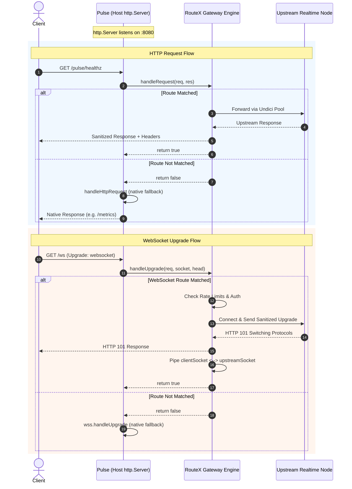

# Design: RouteX Embedded Server API

**Generated by**: `/office-hours` on 2026-09-08  
**Branch**: `main`  
**Repo**: `Pulse-Distributed-Real-Time-Messaging-Infrastructure-` (eventual consumer) / `RouteX` (package provider)  
**Status**: APPROVED  
**Mode**: Builder (Architecture & Systems Infrastructure)  

---

## 1. Executive Summary & Problem Statement

RouteX was engineered as an autonomous Edge API Gateway and Reverse Proxy powered by Fastify, Undici, and Redis. In its current implementation (`@ankit18193/routex-gateway` v1.1.0), `RouteXGatewayServer` assumes standalone operational ownership:
- Its constructor unconditionally instantiates an internal Fastify instance (`this.app = fastify(...)`).
- Fastify creates and encapsulates its own Node.js `http.Server` (`this.app.server`).
- RouteX binds its WebSocket upgrade listener directly to this internal server (`this.app.server.on('upgrade', ...)`).
- Operational startup requires calling `gateway.listen(port, host)`, which binds a network port.
- Gateway shutdown (`gateway.close()`) calls `this.app.close()`, which unconditionally calls `this.app.server.close()`.

When an external host application (specifically **Pulse Realtime Messaging Engine**) already owns the Node.js `http.Server` and its bound network port, running RouteX currently requires a secondary port or process. 

**Goal**: Provide a true embedded API in RouteX that allows RouteX to handle HTTP routing, RFC 6455 WebSocket upgrade proxying, edge rate limiting, and auth over an existing `http.Server` without calling `listen()`, without creating duplicate network ports, and without corrupting the host server's lifecycle.

---

## 2. Constraints & Invariants

1. **Preserve Standalone Fastify Mode**: RouteX must continue to operate as a standalone binary/service via `gateway.listen()`. No existing standalone test or deployment script may break.
2. **Zero Code Duplication**: Reuse existing RouteX building blocks: `ProxyRouter`, `UpstreamPoolManager`, `WebSocketProxyHandler`, `UpstreamHealthTracker`, `RateLimitManager`, `AuthManager`, `CircuitManager`, and `CacheManager`.
3. **No Pulse Changes Yet**: This design doc focuses on the RouteX API surface. Pulse integration occurs in a separate subsequent milestone.
4. **Preserve Phase 1–7 Integrity**: Core Pulse capabilities (connection auth, room broadcast, presence, Redis Pub/Sub, idempotency, metrics) remain untouched.
5. **No Event or Socket Collisions**: RouteX must not blindly hijack `server.on('request')` or `server.on('upgrade')` in a way that causes `ERR_HTTP_HEADERS_SENT` or double-upgrade socket corruption.
6. **Graceful Shutdown Decoupling**: In embedded mode, RouteX must drain its own active WebSocket tunnels, close Undici connection pools, and disconnect Redis clients *without* forcibly closing the host's `http.Server`.

---

## 3. Premises & Architectural Findings

1. **The Fastify `serverFactory` Trap**:
   Passing an existing `http.Server` to Fastify's `serverFactory` registers `fastify.routing` as an unconditional `'request'` listener. If the host application also listens to `'request'`, both handlers execute concurrently. If the host replies to `/healthz` or `/metrics`, Fastify will subsequently attempt to reply or send 404, throwing `ERR_HTTP_HEADERS_SENT`.
2. **The WebSocket Upgrade Collision**:
   Node.js executes all registered `'upgrade'` listeners synchronously on the same socket. If both RouteX and Pulse register uncoordinated `'upgrade'` listeners, both try to write HTTP response headers (Pulse with 401 or 101, RouteX with 101). The socket stream becomes corrupted immediately.
3. **The Upstream Destination Rule**:
   RouteX is a proxy. When RouteX proxies an upgrade or request, it connects via TCP/HTTP to configured `upstreams`. In an embedded deployment where RouteX runs inside the same process as the application, RouteX's upstream URLs must point to where the backend actually listens (e.g. internal loopback port or remote cluster nodes), OR RouteX must provide a clean bypass for local routes.
4. **Lifecycle Ownership Boundary**:
   The entity that calls `http.createServer()` is the sole entity entitled to call `httpServer.close()`. RouteX must manage gateway state (`isShuttingDown`, tunnel draining, health checks, Redis) without terminating the underlying socket listener.

---

## 4. Approaches Considered

### Approach A: Explicit Dispatcher API (Selected & Recommended)
- **Concept**: RouteX exposes explicit dispatch methods (`handleRequest(req, res): Promise<boolean>` and `handleUpgrade(req, socket, head): Promise<boolean>`) along with `ready(): Promise<void>` and `close(): Promise<void>`.
- **Pros**:
  - Absolute zero event collision risk: Pulse explicitly decides when to delegate to RouteX.
  - Transparent fall-through: if RouteX does not match a route, it returns `false` and Pulse handles the request/upgrade natively.
  - Clean lifecycle: `gateway.close()` drains tunnels and connection pools without touching `server.close()`.
  - Minimal implementation surface with maximum architectural safety.
- **Cons**: Requires host to call dispatch methods instead of a single `attach(server)` one-liner.

### Approach B: Server Attachment Adapter (`gateway.attach(httpServer, options)`)
- **Concept**: RouteX takes `server: http.Server` and automatically hooks `server.on('request')` and `server.on('upgrade')` with internal path-checking and fallback callbacks (`onUnhandledRequest`, `onUnhandledUpgrade`).
- **Pros**: High-level one-line setup for consumers.
- **Cons**: Higher complexity; edge cases with listener execution order; tight coupling with Node's internal EventEmitter ordering; Fastify's `server.close()` must be monkey-patched or overridden.

### Approach C: In-Process Dual-Port Gateway (Baseline / Status Quo)
- **Concept**: Pulse runs its engine on `127.0.0.1:9341` and RouteX runs on public `0.0.0.0:8080` in the same Node process.
- **Pros**: Zero changes to RouteX codebase.
- **Cons**: Consumes two TCP ports; does not fulfill the embedded single-server goal.

---

## 5. Detailed Design: The RouteX Embedded API

### 5.1 Public Class Additions & Enhancements

`RouteXGatewayServer` will be enhanced with constructor options and explicit dispatch methods:

```typescript
export interface GatewayServerOptions {
  readonly logger?: boolean | undefined;
  readonly redisClient?: RedisClient | undefined;
  /**
   * When true, disables internal server creation and prepares RouteX for embedded use.
   * Defaults to false (standalone mode).
   */
  readonly embedded?: boolean | undefined;
}

export interface RouteMatchInfo {
  readonly matched: boolean;
  readonly routeId?: string;
  readonly isWebSocket?: boolean;
}
```

### 5.2 Core API Signatures on `RouteXGatewayServer`

```typescript
export class RouteXGatewayServer {
  // Existing public getters...
  
  /**
   * Initializes the gateway without binding to a network port.
   * Compiles routes, initializes Redis, and prepares Fastify routing.
   * Safe to call in both standalone and embedded modes.
   */
  public async ready(): Promise<void>;

  /**
   * Evaluates whether a given URL path and method match a configured RouteX route.
   */
  public matchRoute(urlPath: string, method: string): RouteMatchInfo;

  /**
   * Dispatches an incoming HTTP request through RouteX's Fastify routing and proxy pipeline.
   * Returns true if RouteX handled the request, or false if the route was not matched.
   */
  public async handleRequest(
    req: http.IncomingMessage,
    res: http.ServerResponse
  ): Promise<boolean>;

  /**
   * Dispatches an incoming RFC 6455 HTTP upgrade through RouteX's WebSocket proxying pipeline.
   * Returns true if RouteX accepted and handled the upgrade, or false if not matched.
   */
  public async handleUpgrade(
    req: http.IncomingMessage,
    socket: stream.Duplex,
    head: Buffer
  ): Promise<boolean>;

  /**
   * Gracefully shuts down RouteX:
   * 1. Rejects incoming requests/upgrades with 503.
   * 2. Drains active WebSocket tunnels (socket.end() with deadline timeout).
   * 3. Closes Undici connection pools.
   * 4. Disconnects Redis clients.
   * IN EMBEDDED MODE: Does NOT call httpServer.close().
   */
  public async close(): Promise<void>;
}
```

---

## 6. Request & Upgrade Processing Flow



---

## 7. Graceful Shutdown Semantics

Shutdown in embedded mode follows a strict 4-phase sequence:

1. **State Transition**: `this.isShuttingDown = true`. Any subsequent calls to `handleRequest` or `handleUpgrade` return immediate `503 Service Unavailable`.
2. **Health Check Suspension**: `this.healthTracker.stop()` halts background readiness polling.
3. **Active Tunnel Drainage**: `this.webSocketHandler.closeAll(shutdownTimeoutMs)`. Sends half-duplex `socket.end()` to upstream and downstream sockets, waiting up to the configured timeout before calling `destroy()`.
4. **Resource Teardown**:
   - `this.rateLimitManager.close()` terminates Redis connections.
   - `this.poolManager.close()` closes idle Undici HTTP pools.
   - `this.circuitManager.resetAll()` clears timers.
   - **Crucial Embedded Invariant**: If `options.embedded === true`, Fastify's `this.app.close()` is invoked with a custom hook or bypassed so it **does NOT trigger `this.app.server.close()`**. The host server maintains connection ownership.

---

## 8. Verification & Testing Plan

1. **Standalone Backward Compatibility Tests**:
   - Verify all existing RouteX test suites pass unmodified (`vitest run`).
   - Confirm `RouteXGatewayServer.listen()` still operates seamlessly.
2. **Embedded Unit Tests**:
   - Instantiate `new RouteXGatewayServer(config, { embedded: true })`.
   - Verify calling `await gateway.ready()` initializes router and Redis without opening any network port.
   - Inject `(req, res)` via `gateway.handleRequest()` and verify matched vs unmatched return values.
   - Pass mock `(req, socket, head)` to `gateway.handleUpgrade()` and verify route matching and 404/429/101 behaviors.
3. **Embedded HTTP Server Integration Tests**:
   - Create a native `http.createServer()` on an ephemeral port (`port: 0`).
   - Wire `handleRequest` and `handleUpgrade` into the native server's `'request'` and `'upgrade'` events.
   - Verify:
     - RouteX routes are intercepted and proxied to a mock upstream.
     - Unmatched routes fall through to the native server's fallback handler without `ERR_HTTP_HEADERS_SENT`.
     - Calling `await gateway.close()` leaves the native server listening until `server.close()` is called explicitly.

---

## 9. Next Steps (Implementation Roadmap)

1. **Milestone 1 (RouteX)**: Add `embedded` option and implement `ready()`, `matchRoute()`, `handleRequest()`, and `handleUpgrade()` on `RouteXGatewayServer` in `D:\RouteX\RouteX`.
2. **Milestone 2 (RouteX)**: Add comprehensive unit and integration tests verifying embedded dispatch and graceful shutdown decoupling.
3. **Milestone 3 (RouteX)**: Build and publish `@ankit18193/routex-gateway` (or update npm package).
4. **Milestone 4 (Pulse)**: Update Pulse `package.json` dependency and integrate the embedded API via a clean coordinator in Pulse.
